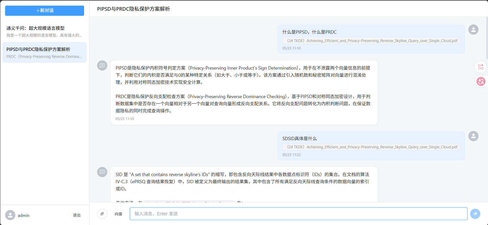

# RAG 智能对话系统

基于 RAG（检索增强生成）的智能对话平台，支持文档上传、多轮对话、混合检索。前后端分离架构。

## 效果展示



## 技术架构

| 层级 | 技术 |
|:-----|------|
| 后端框架 | FastAPI (Python 3.13) |
| 数据库 | MySQL + SQLAlchemy 异步 ORM |
| 缓存 | Redis（会话管理 + 对话列表缓存） |
| 向量库 | ChromaDB（文档嵌入存储） |
| 大语言模型 | qwen-plus-2025-07-28             |
| 重排序模型 | Qwen3-Rerank                     |
| 嵌入模型 | text-embedding-3-large |
| 前端 | Vue 3 + Vite + Element Plus |
| 鉴权 | JWT + Redis 会话（滑动过期） |

## 项目亮点

- **双检索策略**：向量检索 + BM25 关键词检索，合并后 Rerank 重排序
- **滑动会话过期**：每次操作自动续期 7 天，不操作到期自动登出
- **全文 + RAG 双路**：上传文件同时给 LLM 全文和检索片段，回答更准确
- **对话记忆**：滑动窗口 + 摘要压缩，长对话不爆 token
- **中间件鉴权**：全局拦截，白名单放行，JWT + Redis 双层校验

## 核心架构分层

```
backend/
├── app/
│   ├── config/          ← 配置层：MySQL、Redis、环境变量
│   ├── models/          ← 数据模型层：User、Conversation、Message、Document
│   ├── crud/            ← 数据访问层：各表的增删改查
│   ├── service/         ← 业务逻辑层：聊天、会话、用户
│   ├── routers/         ← 路由层：接口定义
│   ├── middleware/       ← 中间件层：JWT 鉴权
│   ├── schemas/         ← Pydantic 模型：请求/响应体
│   ├── utils/           ← 工具层：JWT、密码哈希、缓存
│   └── RAG/             ← RAG 服务：文档解析、切片、嵌入、检索、Rerank
├── .env                 ← 环境变量
└── pyproject.toml       ← 依赖管理

frontend/
├── src/
│   ├── api/              ← 接口层：Axios 封装、请求拦截、所有后端接口
│   ├── stores/           ← 状态层：登录状态、token 管理
│   ├── router/           ← 路由层：路由表、登录守卫
│   ├── views/            ← 页面层：Login、Register、Chat
│   └── components/       ← 组件层：Sidebar、ChatWindow、MessageBubble
├── index.html            ← HTML 入口
├── vite.config.js        ← Vite 配置（端口、代理）
└── package.json          ← 依赖管理
```

## 关键文件职责

| 文件 | 职责 |
|------|------|
| `app/main.py` | 应用入口，中间件注册，CORS |
| `app/middleware/auth_middleware.py` | JWT 鉴权中间件，白名单放行 |
| `app/service/chat_service.py` | 核心：消息处理、RAG 检索、LLM 调用、摘要 |
| `app/RAG/rag_service.py` | 文档加载、切片、向量嵌入、ChromaDB、混合检索 |
| `app/RAG/reranker.py` | DashScope Rerank 重排序 |
| `app/utils/session_cache.py` | Redis Hash 会话管理 |
| `app/utils/jwt_util.py` | JWT 生成与验证 |
| `frontend/src/views/Chat.vue` | 主聊天页 |
| `frontend/src/components/ChatWindow.vue` | 聊天窗口 |
| `frontend/src/components/Sidebar.vue` | 左侧历史栏 |

## 快速启动

### 后端

```bash
cd backend
# 复制环境变量
cp .env.example .env   # 填写 MySQL、Redis、LLM 配置

# 安装依赖并启动
uv sync
uv run uvicorn backend.app.main:app --reload --port 8000
```

### 前端

```bash
cd frontend
npm install
npm run dev   
```

### 依赖服务

- MySQL 8.0+
- Redis 6.0+
- DashScope API Key（阿里云百炼）

## 核心接口

## 

| 方法 | 路径 | 说明 |
|------|------|------|
| POST | `/api/users/register` | 注册 |
| POST | `/api/users/login` | 登录（支持 token 免密续期） |
| POST | `/api/users/logout` | 登出 |
| GET | `/api/users/{id}` | 获取用户信息 |
| PUT | `/api/users/user_info` | 更新用户信息 |
| GET | `/api/conversations/list` | 会话列表（近7天 Redis 缓存） |
| GET | `/api/conversations/{id}` | 会话详情（消息 + 文档） |
| PUT | `/api/conversations/{id}` | 重命名会话 |
| DELETE | `/api/conversations/{id}` | 删除会话（级联） |
| POST | `/api/conversations/messages` | 发送消息（支持文件上传、双检索模式） |
| GET | `/api/documents/list` | 文档列表 |
| DELETE | `/api/documents/{id}` | 删除文档 |
